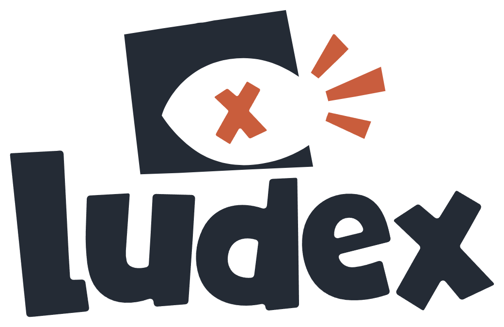

<picture>
  <source media="(prefers-color-scheme: dark)" srcset="ludex-lockup-sombre.png">
  
</picture>

**Toute ta bibliothèque de jeux dans une seule fenêtre.**

[**⬇ Télécharger la dernière version**](https://github.com/Daniboydev/Ludex/releases/latest)

Windows 10 et 11 · 64 bits · gratuit

---

Ludex rassemble ce qui est déjà installé sur ta machine : tes jeux Steam, Epic, GOG, Xbox, EA,
Ubisoft Connect et Battle.net, tes dossiers de jeux locaux, et tes applications créatives. Une
seule grille, une seule recherche, un seul endroit d'où tout se lance.

Il ne télécharge aucun jeu et ne modifie rien sur ton disque. Il lit ce qui s'y trouve.

## Ce qu'il fait

**Il trouve tes jeux tout seul.** Indique un dossier, il repère les jeux qu'il contient et choisit
le bon exécutable — celui du jeu, pas le désinstalleur ni le redistribuable DirectX. Les launchers
officiels sont lus directement dans leurs manifestes, sans avoir à s'y connecter.

**Il les habille.** Jaquettes, descriptions, genres et notes viennent du catalogue public Steam.
La note affiche le pourcentage d'avis positifs converti en étoiles, et le détail dans la fiche.

**Il se pilote à la manette.** Toute l'interface, pas seulement la grille : réglages, fiches,
recherche, menus. Xbox, DualSense et XInput sont reconnues sans réglage.

**Il tient tes applications à jour.** Blender, Krita, DaVinci, Photoshop et une soixantaine
d'autres sont détectées, et celles que winget connaît se mettent à jour depuis Ludex.

**Il t'aide à trouver du nouveau.** Classements Steam, promotions en cours, quatorze genres, et une
recherche d'applications dans le dépôt winget.

## Installation

Deux versions au choix, sur la [page de téléchargement](https://github.com/Daniboydev/Ludex/releases/latest) :

| Fichier | Pour qui |
| --- | --- |
| `Ludex-x.y.z-setup.exe` | **Recommandé.** S'installe, se met à jour tout seul |
| `Ludex-x.y.z-portable.exe` | Aucune installation. Se lance depuis une clé USB, mais ne se met pas à jour seul |

### Windows va afficher un avertissement

**C'est normal, et voici pourquoi.** Ludex n'est pas signé numériquement. Un certificat de
signature coûte plusieurs centaines d'euros par an, et pour un projet gratuit qui débute, cette
dépense n'a pas encore de sens.

Windows affiche donc, au lancement de l'installeur :

> **Windows a protégé votre PC**
> Microsoft Defender SmartScreen a empêché le démarrage d'une application non reconnue.

Pour continuer :

1. Clique sur **Informations complémentaires**
2. Puis sur **Exécuter quand même**

Cet avertissement ne dit pas que le fichier est dangereux. Il dit que Microsoft ne connaît pas
encore son éditeur. Si tu préfères vérifier avant, l'empreinte SHA512 de chaque fichier est
publiée dans le `latest.yml` de chaque Release.

## Mises à jour

La version installée vérifie discrètement s'il en existe une plus récente, et te le dit par un
bandeau. **Rien n'est téléchargé sans ton clic**, et seul ce qui a changé transite — une mise à
jour corrective pèse quelques mégaoctets, pas soixante-quinze.

La version portable t'annonce la nouveauté mais ne peut pas se remplacer elle-même : elle ouvre la
page de téléchargement.

## Où sont mes données

Tout reste chez toi, dans `%APPDATA%\Ludex` : ta bibliothèque, tes réglages, les jaquettes en
cache. Rien n'est envoyé nulle part. Les seuls appels réseau vont au catalogue public de Steam
pour les jaquettes et les notes, au dépôt winget pour les applications, et à cette page pour les
mises à jour.

## Signaler un problème

Les [tickets](https://github.com/Daniboydev/Ludex/issues) sont ouverts. Un jeu mal détecté, une jaquette
qui ne vient pas, un plantage : dis ce que tu attendais et ce qui s'est passé, avec ta version de
Ludex — elle est dans **Réglages → À propos**.

---

Created by danistudio — [danistudio.fr](https://danistudio.fr)

